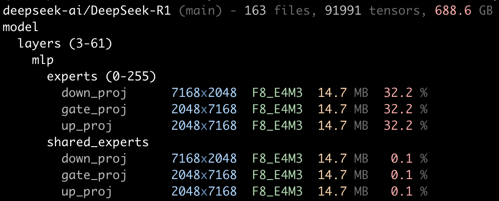

`we` - a weight explorer for Hugging Face models that avoids downloading too much:

<p align="center">
  
</p>

Today it focuses on model introspection. Next steps are compression experiments (TTNN `bfp8`/`bfp4`/`bfp2`) and quality metrics (`pcc`, `atol`) against original weights.

## Quick Start

```bash
python3 -m venv .venv
source .venv/bin/activate
pip install -r requirements.txt
```

Run the tool:

```bash
./we Qwen/Qwen3-0.6B
```

## Usage

```bash
we [repo_or_url] [filter_query] [--revision REVISION] [-c FORMAT]
```

Examples:

```bash
# Full model tree
./we Qwen/Qwen3-0.6B

# Substring filter (includes matching module + all descendants)
./we Qwen/Qwen3-0.6B mlp

# Torch-style exact path filter
./we Qwen/Qwen3-0.6B model.layers.1

# URL input also works
./we https://huggingface.co/Qwen/Qwen3-0.6B/tree/main

# Local model folder or file path also works
./we /path/to/local/model_dir model.layers.1

# Specific branch/tag/commit
./we Qwen/Qwen3-0.6B --revision main

# Run host-side bfp8 round-trip + quality metrics on matched tensors
./we Qwen/Qwen3-0.6B model.layers.1.self_attn -c bfp8

# Run bfp8 and bfp4 in explicit order
./we Qwen/Qwen3-0.6B model.layers.1.self_attn -c bfp8 -c bfp4

# Explicitly run all supported compression formats
./we Qwen/Qwen3-0.6B model.layers.1.self_attn -c all
```

## Output Notes

- Repeated numeric modules collapse into ranges when possible, e.g. `layers (0-27)`.
- Mixed structures (for example early dense layers then MoE layers) collapse by contiguous matching runs.
- F8 pair pattern (`weight` + `weight_scale_inv`) is rendered as a single logical row and hides `weight_scale_inv`.
- Percentages account for collapsed multiplicity (so `%` reflects true total contribution).
- `-c [FORMAT]` appends ` | <min> ≤ <mean> ≤ <max> | <format>  <pcc> pcc <atol> atol` blocks after the size/% columns.
- Supported formats today: `bfp8`, `bfp4`. Repeat `-c` for multiple formats; use `-c all` to run all.
- Compression only downloads the shard files that contain matched tensors (file-level granularity, via HF cache).

## Caching

`we` uses a local metadata cache so repeated runs are fast without downloading full weights.

- Cache directory (default): `~/.cache/we/metadata`
- Override cache location: `WE_CACHE_DIR`
- Automatic refresh: based on remote revision identity (`sha`), with a 1-hour TTL on revision checks

This means:

- repeated calls within 1 hour are fully local
- after 1 hour, `we` checks remote revision and refreshes only if changed

## Color

`we` uses 256-color pastel output in terminals that support it.

- Disable colors: `NO_COLOR=1`
- Force colors: `FORCE_COLOR=1`

## Project Layout

- `we` - executable CLI script
- `requirements.txt` - Python dependencies
- `docs/assets/deepseek_example.png` - README screenshot
